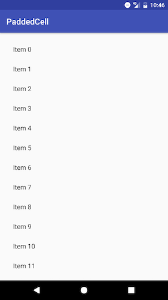
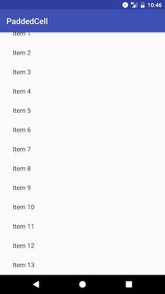

<!-- excerpt.start -->
In Android, a layout is composed from a hierarchy of views. Each view has a parent (up until the root view) and a ViewGroup can have child views. When a layout gets inflated at runtime, the framework measures each view according to its attributes about sizing and spacing. The result of a view's measurements is also dependent on its parent and any sibling views.

RecyclerView is like most views in this respect but has some peculiarities. This comes down to a few reasons. RecyclerView sees regular updates by the Android team and sometimes its behavior with how it's measured changes. And while it is a ViewGroup, its child views are provided indirectly through an adapter and managed by a LayoutManager. Lastly, its behavior to scroll sets it apart from most static views.<!-- excerpt.end -->

The original RecyclerView implementation did not support autosizing. For instance, if you wanted it to only be as large as its contents and scroll only if there is no more space left on the screen, this was not previously possible. In v23.2.0 of the support library, autosizing was added and such behavior now became possible.

This had an ill-effect for code that depended on the behavior of the old implementation. Previously, child views provided by the adapter would be measured the same regardless if their height (assuming vertical scrolling) was match_parent or wrap_content. With the new autosizing feature, children with a height of match_parent now fill the entire available space of the RecyclerView. In some scenarios this is helpful, but for legacy code this resulted in undesired behavior.

Assuming you are using the latest version of the support library, you can now have the RecyclerView change its size based on its children by using wrap_content. If you want it to take up the entire available space, use match_parent like before. For children, you will most likely want to use wrap_content. If you only want a single child visible for scrolling at a time, such as with a ViewPager, use match_parent.

Another area that can be a bit tricky to figure out is padding. Typically, you want padding between the RecyclerView and its children, as well as spacing between each item. In general, I would say it's best to make padding (and margins) zero for each child. Leave the spacing to the RecyclerView to manage.

If we want to have 16dp of padding between the child views and the RecyclerView, we just go ahead and specify it on the RecyclerView directly. One peculiarity of this has to do with scrolling. If the RecyclerView scrolls vertically and you have a top padding of 16dp, then the child views disappears 16dp from the top of the RecyclerView. What we really want is for the initial child view to be 16dp from the top and then scroll past this padding and to the top of the RecyclerView.

By setting clipToPadding to false on the RecyclerView, we can get this desired behavior. We have our initial padding at the top of 16dp and as the scrolling begins, the items will disappear at the top of the RecyclerView and not where the padding is. The same goes for the bottom padding and the start and end padding if it scrolls horizontally.

Here's a simple RecyclerView that supports each of these features:

To deal with the spacing between items, we can use an ItemDecoration. For example, here is a simple reusable ItemDecoration that lets you specify the amount of space between each item:

It applies an offset to the bottom of each item except for the last one (our RecyclerView should already specify the padding at the bottom for us). We can then  simply add this ItemDecoration to our RecyclerView with the desired padding:

Perhaps the only time you want to forego this and specify a margin directly on a child view is if you have variable spacing for different views in your adapter. For instance, we may have a header view that needs a different amount of padding than the other views in the adapter.

One last thing to note is that if you are placing a RecyclerView inside of a scrollable container, make sure you use a NestedScrollView as its parent. Using the original ScrollView can result in weird (and not always easily reproducible) behavior with how the RecyclerView is measured.

RecyclerView has seen a fair amount of change in just a few years. The good news is that these changes have made the RecyclerView more powerful by being more flexible in how it's measured. By using the knowledge presented here, you can be rest assured that your RecyclerView will look and behave the way you want it to.