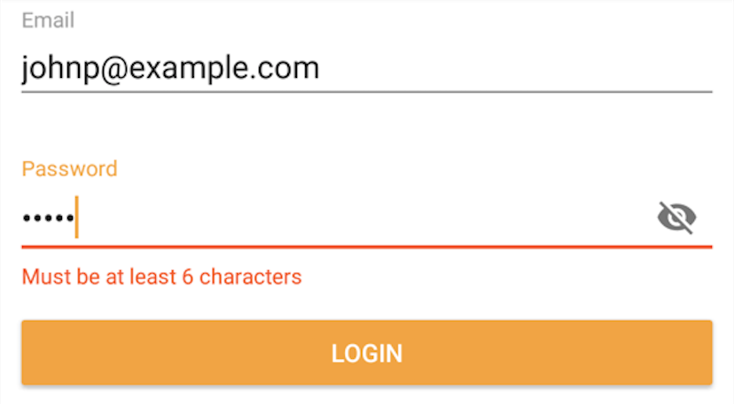

<!-- excerpt.start -->
As part of the [Support Design library introduced in 22.2.0](https://developer.android.com/topic/libraries/support-library/rev-archive.html#rev21-2-0), the Android team added [TextInputLayout](https://developer.android.com/reference/android/support/design/widget/TextInputLayout.html). Stemming from the [material design guidelines](https://material.io/guidelines/components/text-fields.html#text-fields-states), it adds a few visual enhancements to our regular old EditTexts:

- Floating label for hint
- Password visibility toggle
- Character counter
- Error indicator

I want to focus on the last one, displaying an error when an input is invalid, since it requires writing additional business logic to support.
<!-- excerpt.end -->

<i>A few of the things TextInputLayout provides</i>

Let's assume we want to show an error indicator if the user's password is less than six characters. First, we wrap our existing EditText in a TextInputLayout:


<android.support.design.widget.TextInputLayout
    android:id="@+id/password_layout"
    android:layout_width="match_parent"
    android:layout_height="wrap_content">

    <EditText
        android:id="@+id/password"
        android:layout_width="match_parent"
        android:layout_height="wrap_content"
        android:hint="@string/password_hint"
        android:inputType="textPassword" />

</android.support.design.widget.TextInputLayout>


From our view, we'll validate if the password input meets our requirement:


submit.setOnClickListener(v -> {
    if (password.getText().length() >= 6) {
        login();
    } else {
        passwordLayout.setError(getString(R.string.password_error));
    }
});


Pretty straightforward stuff. Things become a bit more complicated and tedius if we need to validate multiple inputs at once. Let's assume there is also an email field, which requires a valid email address:


submit.setOnClickListener(v -> {
    boolean allInputsValid = true;
    
    if (Patterns.EMAIL_ADDRESS.matcher(email.getText()).matches()) {
        emailLayout.setError(getString(R.string.email_error));
        allInputsValid = false;
    } else {
        emailLayout.setError(null); // hide error indicator
    }
    
    if (password.getText().length() < 6) {
        passwordLayout.setError(getString(R.string.password_error));
        allInputsValid = false;
    } else {
        passwordLayout.setError(null); // hide error indicator
    }
    
    if (allInputsValid) {
        login();
    }
});


There's a pattern here that can be applied for each input:

1. Extract the input string from the EditText
2. Validate string against some some arbitrary rule (or ruleset)
3. Depending on validity:
    - Hide error indicator
    - Show error indicator and invalidate entire form

If all form inputs are valid, we can move forward with the desired operation (e.g. logging in). If one or more inputs are invalid, the user is blocked from proceeding.

This solution ended up becoming the premise for a tiny library I wrote, called [Validator](https://github.com/jpetitto/validator). Let's rewrite our previous example using it:


<com.johnpetitto.validator.ValidatingTextInputLayout
    android:id="@+id/email_layout"
    android:layout_width="match_parent"
    android:layout_height="wrap_content"
    app:validator="email"
    app:errorLabel="@string/email_error">

    <!-- our email EditText -->

</com.johnpetitto.validator.ValidatingTextInputLayout>

<com.johnpetitto.validator.ValidatingTextInputLayout
    android:id="@+id/password_layout"
    android:layout_width="match_parent"
    android:layout_height="wrap_content"
    app:errorLabel="@string/password_error">

    <!-- our password EditText -->

</com.johnpetitto.validator.ValidatingTextInputLayout>


We've simply replaced TextInputLayout with ValidatingTextInputLayout. The usefulness here is that we can declare each error label statically if we wish. We can also add a predefined validator for email (phone, too) as an attribute.

The Java code becomes short and concise:


passwordLayout.setValidator(input -> input.length() >= 6);

submit.setOnClickListener(v -> {
    if (Validators.validate(emailLayout, passwordLayout)) {
        login();
    }
});


There's even a helper for creating a Validator that meets a minimum number of characters:


passwordLayout.setValidator(Validators.minimum(6));


We can optionally pass in a second argument of `true` to request that the input be trimmed before validating.

I've found this library to be useful in the apps I'm working on and maybe you will too. To add this library to your project:


compile 'com.johnpetitto.validator:validator:1.0.2'


Feel free to comment below or [open a GitHub issue](https://github.com/jpetitto/validator/issues) if you run into any problems.
